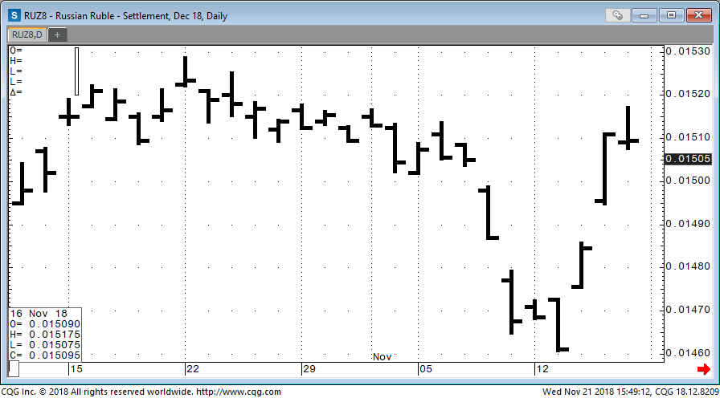
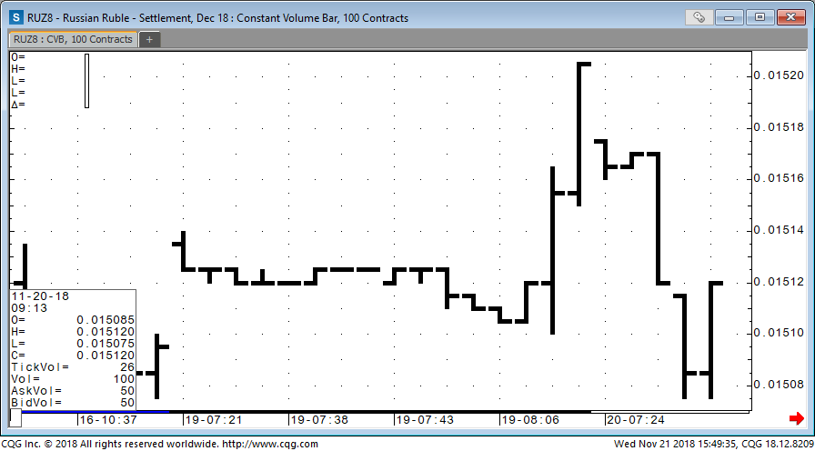

### WinAPI и DLL
# Лабораторная работа

## Теория

Необходимо разработать приложение, которое умеет строить бары по “приходящим тикам с биржи”.

Примеры графиков из CQG IC показаны ниже. Здесь каждый столбик – это бар.
Горизонтальные чёрточки слева/справа означают цену открытия/закрытия бара.
Верхнее/нижнее значения бара означают максимум/минимум цены внутри бара.

Тики могут группироваться по времени (минуты, часы, дни, месяцы и тд.).
На графике показаны дневные бары. 



Другой способ – это группировка по количеству тиков. Например, тут  каждый бар содержит 100 тиков:



## Задание

Ваше приложение, для простоты, должно быть консольным.
Тики должны группироваться в бары по времени.
Время бара должно задаваться пользователем при запуске приложения.
Бары должны печататься в текстовом виде в консоли
(OHLC (open, high, low, close) – цена открытия, максимум, минимум и цена закрытия).

Формат логов:
* Для нового тика: цена @ время
* Для нового бара: Bar closed [Open; High; Low; Close]

Пример:
```
>> 1253 @ 16:24:37
>> 1235 @ 16:24:42
>> 1257 @ 16:24:49
>> Bar closed [1253; 1257; 1235; 1257]
>> 1258 @ 16:24:54
>> 1256 @ 16:25:21
>> 1254 @ 16:27:31
>> Bar closed [1258; 1258; 1234; 1254]
>> ...
```

Тики посылает специальная функция, содержащаяся в dll-файле.

Вам необходимо создать dll-ку с помощью .cpp и .h, приложенных к заданию.
Не нужно менять эти файлы. Нужно создать проект (добавив туда эти файлы),
который скомпилируется в dll.
Смотри папку attachments.

После чего создать **отдельный** exe-файл, который работает с этой dll-кой.
Для получения данных необходимо:
1. Связать неявно dll-файл с приложением (подробнее см. ниже).
2. Вызвать функцию `StartFeed()`, которая запускает генератор тиков.
3. Считать тики в структуру `Tick` при помощи функции GetMessage.
``` cpp
#include "TickerPlant.h" // contains struct Tick
#include "windows.h"

MSG msg; 
GetMessage(&msg, NULL, 0, 0);
```
В поле `lParam` структуры `msg` будет храниться указатель на структуру `Tick`.
Необходимо сделать `reinterpret_cast<Tick*>(msg.lParam)`, чтобы получить этот указатель.

4. Генератор тиков выделяет память под отправляемую структуру, поэтому вам необходимо её освобождать.
5. По окончании приёма тиков, вызвать функцию `StopFeed()`.
6. Для совместимости работы с генератором тиков установить Debug-конфигурацию.

Для неявного подключения dll необходимо:
1. В свойствах проекта прописать полный путь к h-файлу
(Configuration Properties->C/C++->General->**Additional Include Directories**).
2. В свойствах проекта прописать полный путь к lib-файлу
(Configuration Properties->Linker->General->**Additional Library Directories**).
3. В свойствах проекта прописать имя lib-файла
(Configuration Properties->Linker->Input->**Additional Dependencies**).
4. Подключить h-файл к файлу исходного кода вашего приложения.
5. Скопировать dll-файл в папку с exe-файлом вашего приложения.

## Дополнительные сведения:

Для перевода времени в строковый формат можно использовать функцию
``` cpp
size_t strftime(char* ptr, size_t maxsize, const char* format, const struct tm* timeptr);
```

В качестве `format` можно указать строку `"%X"` для вывода времени в виде ЧЧ:ММ:СС.

Для представления времени в секундах можно использовать функцию
``` cpp
time_t mktime(struct tm * timeptr);
```
